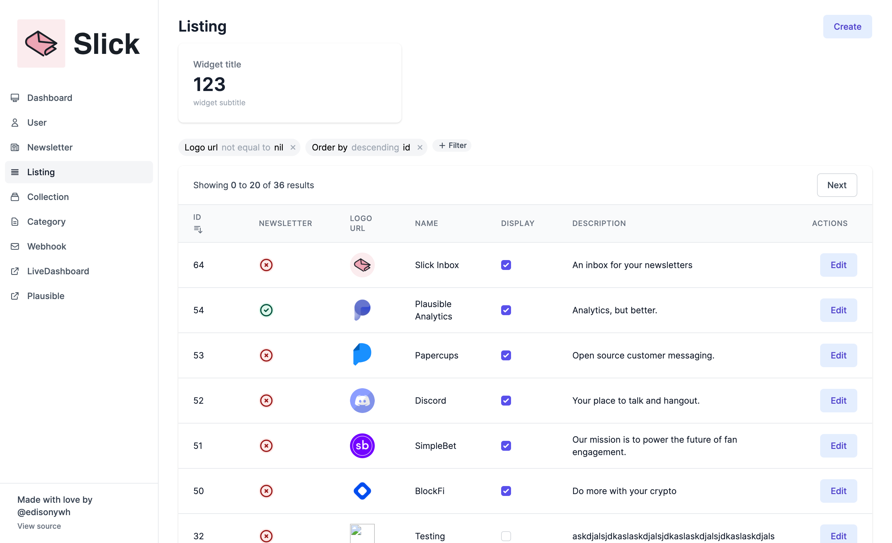

# Backoffice



Backoffice is an admin tool built with the PETAL stack (**P**hoenix, **E**lixir, **T**ailwind, **A**lpine, **L**iveView).

## Why did you build Backoffice?

I was working on refactoring [Slick Inbox](https://slickinbox.com). I looked at my admin tool which is built with LiveView, and didn’t like the repetitions that I saw. I am repeating a lot of the same things (search, pagination, form components, index.html etc) on every admin page that I have. They’re pretty simple pages. So why not refactor that?

I looked at the repetitive stuffs, extracted them, and then suddenly it looks like it could be general enough to be a library, so I experimented more and thus born `Backoffice`! 🎉

Another reason is that I think it would be awesome to have more LiveView projects in the open where we can learn from each other!

## What about other alternatives?

I know of three alternatives thus far:

- [Ash Admin](https://github.com/ash-project/ash_admin)
- [Torch](https://github.com/mojotech/torch)
- [Kaffy](https://github.com/aesmail/kaffy)

Ash Admin seems to only support Ash resources, and I don't use that, so that doesn't work for me.

Torch is a generator, it hooks onto the Phoenix generator and then generate resources for you. I'm not sure if I like that idea (you don't get updates for free) but I think the filter feature is pretty neat.

Kaffy is probably the most matured out of the three, and so I'll mostly be comparing to it.

1. Kaffy uses controllers, Backoffice uses LiveView
2. Kaffy works by `using` it in your router, the available paths are hidden from you, and you supply the configurations via application env, whereas Backoffice prefers explicitness (per module) and less on application env.
3. Kaffy has a more seamless experience as it magics its way across your schemas, with Backoffice it requires a longer set-up as you need to create modules per page (but more explicit).
4. Kaffy works under the assumption of your application being database-backed - Backoffice has an interesting `Resolver` concept, so you can write your own resolver and fetch your data from anywhere.

For example, with Kaffy:

```elixir
# router.exs
defmodule YourApp.Router do
  use Kaffy.Routes
end
```

I’m not a fan of this idea since it’s not immediately obvious what routes are available. Kaffy routes are defined in `config.exs` (application env) which could potentially call out to a different `Config` module as well, but I prefer things to be colocated. To me, `router.exs` is the source of truth for the available routes in my app, so I prefer to keep everything centralised.

Therefore, with Backoffice:

```elixir
# router.exs

scope "/admin", YourAppWeb, do
  live("/users", UserLive.Index, :index) # these are your existing pages
  live("/users/:id/edit", UserLive.Index, :edit)

  live("/newsletters", Backoffice.NewsletterLive.Index, layout: {Backoffice.LayoutView, :backoffice})
  live("/newsletters/:id/edit", Backoffice.NewsletterLive.Single, layout: {Backoffice.LayoutView, :backoffice})
end
```

It sits right next to your existing set-up! This was my main goal, to easily see what routes are available to me.

But, as you might have noticed, this means you need to create a lot more modules, compared to Kaffy.

> I should also add that I referred to Ash Admin's and Kaffy's codebase quite a bit, so huge thanks to the contributors!

## Usage

1. Create a Layout module

```elixir
# lib/your_app_web/live/backoffice/layout.ex
# Icons are all from heroicons.com.
defmodule YourAppWeb.Backoffice.Layout do
  @behaviour Backoffice.Layout

  alias YourAppWeb.Routes.Helpers, as: Routes

  def stylesheets do
    [
      Routes.static_path(YourAppWeb.Endpoint, "/css/app.css")
    ]
  end

  def scripts do
    [
      Routes.static_path(YourAppWeb.Endpoint, "/js/admin.js")
    ]
  end

  def logo do
    Routes.static_path(YourAppWeb.Endpoint, "/images/admin-logo.svg")
  end

  def links do
    [
      %{
        label: "User",
        link: YourAppWeb.Router.Helpers.user_index_path(YourAppWeb.Endpoint, :index),
        icon: """
          <svg xmlns="http://www.w3.org/2000/svg" fill="none" viewBox="0 0 24 24" stroke="currentColor">
            <path stroke-linecap="round" stroke-linejoin="round" stroke-width="2" d="M16 7a4 4 0 11-8 0 4 4 0 018 0zM12 14a7 7 0 00-7 7h14a7 7 0 00-7-7z" />
          </svg>
        """
      },
      %{
        label: "Nested Links",
        expanded: true # default to false
        links: [
          %{
            label: "Nested 1",
            link: "#"
          },
          %{
            label: "Nested 2",
            link: "#"
          }
        ]
      }
      %{
        label: "LiveDashboard",
        link: "/admin/dashboard",
        icon: """
          <svg xmlns="http://www.w3.org/2000/svg" fill="none" viewBox="0 0 24 24" stroke="currentColor">
            <path stroke-linecap="round" stroke-linejoin="round" stroke-width="2" d="M10 6H6a2 2 0 00-2 2v10a2 2 0 002 2h10a2 2 0 002-2v-4M14 4h6m0 0v6m0-6L10 14" />
          </svg>
        """
      },
    ]
  end
end
```

2. Tell Backoffice about the layout you just created.

```elixir
# config.exs
config :backoffice, layout: YourAppWeb.Backoffice.Layout
```

3. Create a resource module:

```elixir
# lib/your_app_web/live/backoffice/users/index.ex
defmodule YourAppWeb.Backoffice.UserLive.Index do
  use Backoffice.Resource.Index,
    resolver: Backoffice.Resolvers.Ecto,
    resolver_opts: [
      repo: YourApp.Repo,
      # Use preload and order_by
      preload: [:mailbox, :notification_preference],
      order_by: :id
    ],
    resource: YourApp.Accounts.User

  actions do
    action :create, type: :page, handler: &__MODULE__.create/2
    action :retry, type: :single, handler: &__MODULE__.retry/2
  end

  def retry(socket, resource_id) do
    ...
    {:noreply, socket}
  end

  def create(socket, ids) do
    ids = Enum.map(&(String.to_integer/1))

    {:noreply, push_patch(socket, to: YourApp.Router.Helpers.live_path(socket, YourAppWeb.Backoffice.UserLive.Single, []))}
  end

  index do
    field :id
    field :verified, :boolean
    field :age, :string, render: &__MODULE__.field/1 # 1-arity only, takes the resource itself
  end
end

# lib/your_app_web/live/backoffice/users/single.ex
defmodule YourAppWeb.Backoffice.UserLive.Single do
  # We name it single because it handles both :new and :edit.
  use Backoffice.Resource.Single,
    resolver: Backoffice.Resolvers.Ecto,
    resolver_opts: [
      repo: YourApp.Repo,
      changeset: %{edit: &YourApp.Accounts.User.update_changeset/2},
      preload: [:mailbox, :notification_preference]
    ],
    resource: YourApp.Accounts.User

  form do # default for both
    field :verified, :boolean
    field :username, :string
    field :age, :custom, label: "Age", render: &__MODULE__.field/2 # 2-arity, `form` and `field`.
  end

  form :edit do # form for :edit action
    ...
  end

  form :new do # form for :new action
    ...
  end
end
```

4. Provide the following plug in your endpoint.ex

```elixir
plug Plug.Static,
    at: "/backoffice",
    from: :backoffice,
    gzip: false,
    only: ~w(css js)
```

If `/backoffice` conflicts with one of your existing routes, you can customize the static_path in `YourAppWeb.Backoffice.Layout`

```elixir
# lib/your_app_web/live/backoffice/layout.ex
  
  # Add this. Defaults to "/backoffice" if not overriden
  def static_path(), do: "/whatever_you_want"  

  # ...  the stylesheets, scripts, logo and links function
end 

# lib/your_app_web/endpoint.ex
defmodule MyAppWeb.Endpoint do

    # Add this instead
    plug Plug.Static,
      at: YourAppWeb.Backoffice.Layout.static_path(),
      from: :backoffice,
      gzip: false,
      only: ~w(css js)

   # ... other plugs
end 

5. Set-up your resource module in the router.

```elixir
scope "/admin", YourAppWeb, do
  live("/users", Backoffice.UserLive.Index, layout: {Backoffice.LayoutView, :backoffice})
  live("/users/:id/edit", Backoffice.UserLive.Single, layout: {Backoffice.LayoutView, :backoffice})
end
```

6. You are done!

## Resolvers?

One interesting tidbit about Backoffice is that Backoffice itself doesn't make any assumption about where your data is from. This is pretty cool as it means Backoffice can ingest data from everywhere and display them!

The only requirement/caveat is:

- You need to build your own Resolver
- Your resource still needs to be a schema (embedded or not)

For example, you can write up an API resolver like this.

```elixir
defmodule Todo do
  use Ecto.Schema

  @primary_key false
  embedded_schema do
    field :userId, :string
    field :id, :string
    field :completed, :boolean
    field :title, :string
  end
end

defmodule Backoffice.Resolvers.API do
  @behaviour Backoffice.Resolver

  @impl true
  def load(Todo, resolver_opts, _page_opts) do
    url = Keyword.fetch!(resolver_opts, :url)

    resp = HTTPoison.get!(url)

    entries =
      resp.body |> Jason.decode!(keys: :atoms) |> Enum.take(20) |> Enum.map(&struct!(Todo, &1))

    # This is required for the pagination buttons to work
    %Backoffice.Page{
      entries: entries,
      page_number: 1,
      page_size: 10,
      total_entries: 100,
      total_pages: 5
    }
  end

  @impl true
  def search(mod, resource, resolver_opts, page_opts) do
    load(resource, resolver_opts, page_opts)
  end
end
```

## Widgets and Widget Protocol

Backoffice currently ships with one widget, `Backoffice.PlainWidget`.

To display widgets, just do:

```elixir
# lib/your_app_web/live/backoffice/user.ex

def widgets(socket) do
  [
    %Backoffice.PlainWidget{
      title: "Total Collection",
      data: "12"
    }
  ]
end
```

Widgets in Backoffice are rendered with a protocol, so it is very easy for you to write one. You can refer to `Backoffice.PlainWidget`.

```elixir
defmodule YourWidget do
  defimpl Backoffice.Widget do
    def render do
      {:safe, "Your Widget here"}
    end
  end
end
```

You can also render widget in your own custom page, just do `Backoffice.Widget.render(widget)`.

## Custom pages

Backoffice sits right next to your existing routes, this means to render custom pages, you need to:

```elixir
live("/dashboard", Admin.DashboardLive, layout: {Backoffice.LayoutView, :backoffice})
```

That's it! If you visit `/dashboard` it'll sit nicely next to the rest of the Backoffice layout. If you want to add it to the `links` on the left panel, update the `links/0` function in the layout module you supplied to Backoffice.

## Actions

Backoffice has two kinds of actions: `Page` and `Single`.

Page actions go on the top right of the page, whereas `Single` actions go inside each row.

Here's what an example actions set-up look like.

```elixir
actions do
  action :create, type: :page, handler: &__MODULE__.create/2 # :label & :confirm are valid options
  action :retry, type: :single, handler: &__MODULE__.retry/2
end

def retry(socket, resource_id) do
  ...
  {:noreply, socket}
end

# Right now second argument to create is nil, but we might pass down list of ids down the road.
def create(socket, nil) do
  {:noreply, push_patch(socket, to: YourApp.Router.Helpers.user_index_live(socket, :new, []))}
end
```

## Notifications

Backoffice has a neat little notification pop-up, you can also use it in your custom actions, or anyway you like.

For example,

```elixir
actions do
  action :notify, type: :single, handler: &__MODULE__.notify/2
end
def notify(socket, id) do
  # `push_notification/2` is an API provided by `Backoffice.LiveView.Helpers`.
  {:noreply, push_notification(socket, title: "Editing #{id}", subtitle: "Subtitle")}
end
```

You can decide to show the notification pop-up when the resource is successfully updated for example, or you could use it on your Dashboard and hook it up to PubSub (maybe to monitor every purchase!), like so:

```elixir
# lib/your_app_web/live/backoffice/users/index.ex
defmodule YourAppWeb.Backoffice.UserLive.Index do
...
  def mount(params, session, socket) do
    if connected?(socket), do: Phoenix.PubSub.subscribe(My.PubSub, "info")
    do_mount(params, session, socket) # `do_mount` is needed for backoffice to function.
  end
  def handle_info({:info, text}, socket) do
    {:noreply, push_notification(socket, level: :info, title: "PubSub", subtitle: text)}
  end
...
end
```

There's three level of notifications available right now, `:info`, `:success` and `:error`. E.g: `push_notification(socket, level: :error)`. Defaults to `:info`.

If you want to use notification in your custom page, there are two things you need. Refer to `Backoffice.LiveView.Helpers.push_notification/2` for more information.

There's also a slight caveat, you can't use `push_redirect` with `push_notification`, because [`push_redirect` doesn't work with `push_event`](https://github.com/phoenixframework/phoenix_live_view/blob/v0.15.4/lib/phoenix_live_view/utils.ex#L208-L214) (which is what `push_notification` uses under the hood). For that reason, Backoffice provides a callback so you can still do redirection, just do `push_notification(socket, redirect: url)`.

## Can I use Backoffice in production?

You sure can, but I would not really advise it. Backoffice is pre-release and in active development now, so it's bound to have a lot of breaking API changes. Use at your own risk.

For what it's worth, I am dogfooding it in production with [Slick Inbox](https://slickinbox.com).

There are quite a number of issues right now:

- [ ] Index & Form fields default might not be the best (form fields right now attempts to show assocs, but you need to explicitly preload it and you can't really edit them yet.)
- [ ] Association support is not great (it kinda works, but needs more testing/documentation)
- [ ] etc...

But, I encourage you to try it out anyway and contribute, and together we can make Backoffice great :)

## What's next for Backoffice?

Honestly I'd really love for the community to contribute more, as I've mentioned before, Slick's admin tool usage is pretty basic, so I'm fairly certain there are a lot of use cases that Backoffice is not equipped to handle. I'd also love to learn more LiveView patterns and/or tips & tricks from the community.

Other than that, here are some things I hope to improve:

- [ ] Better support for associations?
- [ ] Custom color/theme
- [ ] Better animations
- [ ] Datepicker support
- [ ] LiveComponent support (It is possible now, but I want to refine the API)
- [ ] Implement a test suite..
- [ ] Localization support?
- [ ] Authorisation?
- [ ] Better documentations

## Installation

Backoffice is not yet available on Hex, so to try it out you'd need to point to this Git repo.

```elixir
def deps do
  [
    {:backoffice, git: "https://github.com/edisonywh/backoffice"}
  ]
end
```
